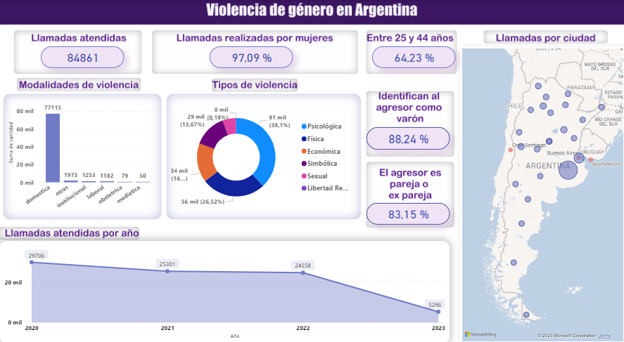
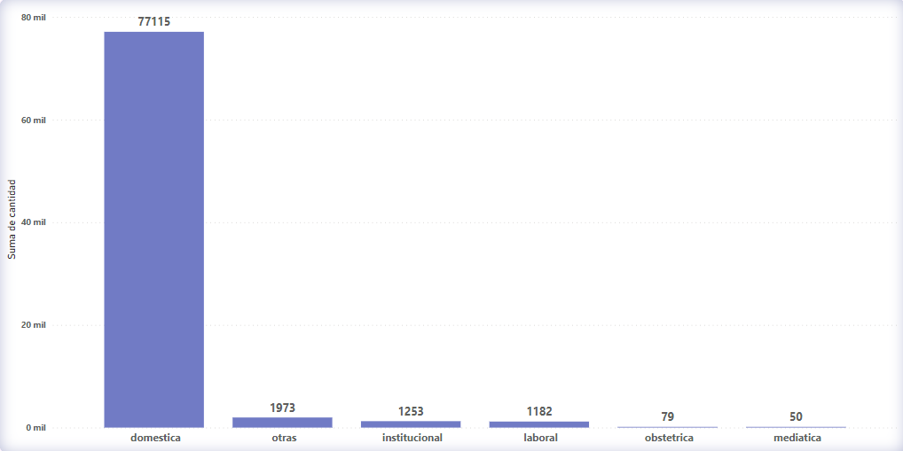
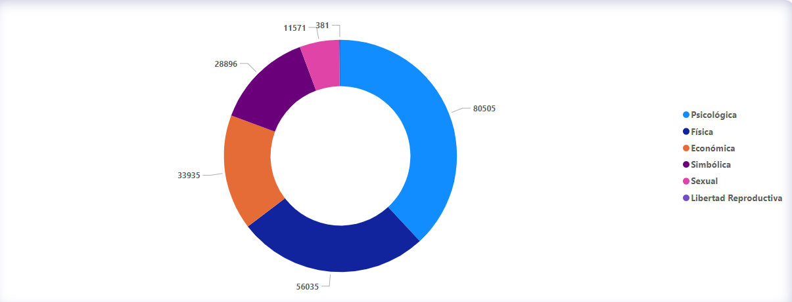
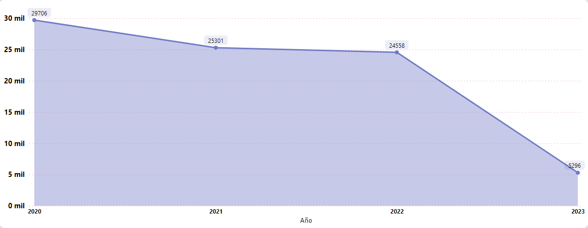
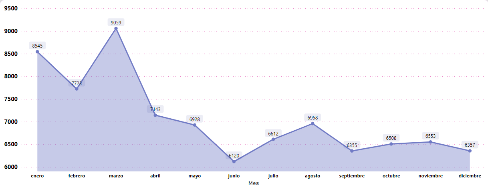

# <h1 align="center">**`Análisis de los datos de la Línea 144 sobre casos de violencia de género`**</h1>

  

El presente informe aborda los datos recopilados en la Línea 144, un canal de acceso para víctimas que ofrece orientación, contención, articulación y seguimiento ante situaciones de violencia de género. Los datos analizados comprenden los años 2020 hasta marzo de 2023.

Durante este período, se atendieron un total de 84,861 llamadas a la Línea, donde el 97.09% fueron realizadas por personas que se autoperciben como mujeres, siendo el 64.23% (54,507) mujeres entre 25 y 44 años.

Es crucial conocer que existen distintas modalidades de violencia además de los diferentes tipos. Las modalidades más conocidas son doméstica, institucional laboral, obstétrica y mediática.

En cuanto a las modalidades, el 90% de las llamadas correspondieron a la violencia doméstica, con 77,115 casos registrados.

Asimismo, se identificaron diversos tipos de violencia, entre ellos psicológica, física, económica, simbólica, sexual y de libertad reproductiva. El 96% de las víctimas manifestaron sufrir violencia psicológica, el 66% violencia física y el 40% violencia económica o patrimonial.

Respecto a los agresores, el 88.24% fueron identificados como varones y en el 83.15% de los casos, el vínculo con el agresor era de pareja o ex pareja.

Además, al analizar la distribución de llamadas por provincia, se observó una significativa diferencia, donde aproximadamente el 50% de las denuncias provienen de la provincia de Buenos Aires.

El análisis también reveló que el año 2020 tuvo un número considerablemente alto de llamadas, que luego disminuyó y se mantuvo más estable para los años 2021 y 2022. Sin embargo, el año 2023 muestra un número más bajo debido a que solo se tienen datos hasta marzo.

En cuanto a la variación por meses, se notó una tendencia con mayores denuncias en los primeros tres meses del año (enero, febrero y marzo).

**Conclusión:**

La violencia de género es una problemática de extrema importancia y todos debemos tomar conciencia sobre su existencia y gravedad en nuestra sociedad. Cada uno de nosotros puede contribuir a prevenirla y erradicarla. Si conoces algún caso de violencia, es fundamental denunciarlo a la Línea 144, ya que muchas veces la víctima no tiene el valor suficiente para hacerlo por sí misma. Juntos, podemos marcar la diferencia y trabajar hacia un futuro donde la violencia de género sea cosa del pasado.

## **Datos de contacto**

+ Gmail: martinezpabloagustin1@gmail.com
+ Whatsapp: +54 3875066128